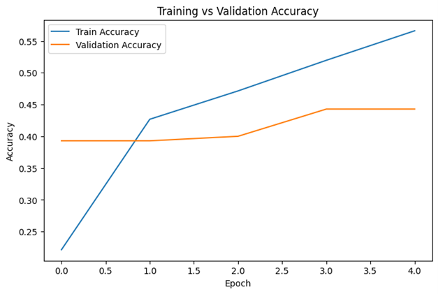
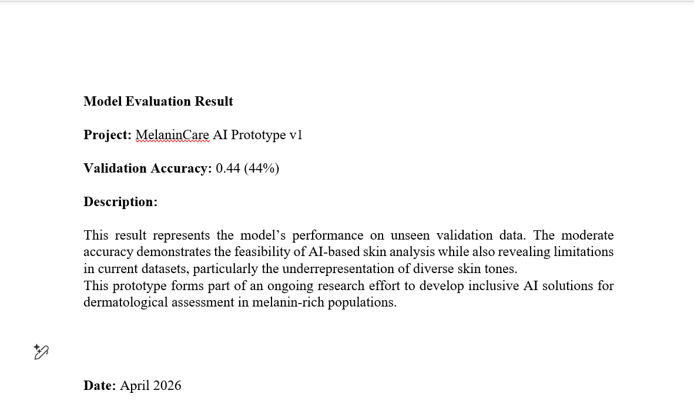
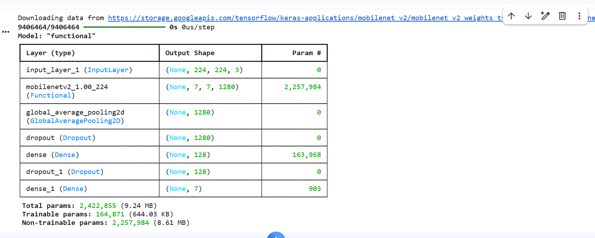

# MelaninCare AI – Skin Analysis Prototype with Power BI Dashboard

Developed by Chidinma Charity Igwe

## Project Overview

MelaninCare AI is a machine learning prototype designed to explore fairness, bias, and performance challenges in dermatological AI systems, particularly for melanin-rich skin tones.

This project combines machine learning and data visualisation to evaluate how well a trained model generalises to unseen data and highlights the impact of dataset limitations in healthcare AI.

## Objectives

- Analyse model performance using training and validation accuracy  
- Identify overfitting and generalisation gaps  
- Highlight dataset bias in dermatology AI  
- Demonstrate an end-to-end data workflow (AI → analysis → dashboard)  

## Machine Learning Model

The model was developed using deep learning techniques:

- Transfer Learning: **MobileNetV2**
- Framework: **TensorFlow / Keras**
- Environment: **Google Colab**

### Key Steps:
- Data preprocessing and preparation  
- Model training on image dataset  
- Validation on unseen data  
- Performance evaluation  

## Model Results

- **Training Accuracy:** 0.57  
- **Validation Accuracy:** 0.44  

### Key Observation:
The gap between training and validation accuracy indicates **overfitting**, meaning the model performs better on training data than on unseen data.

This suggests:
- Limited dataset diversity  
- Poor generalisation capability  
- Potential bias in skin tone representation  

## Visual Results

### Training Accuracy

### Validation Results

### Model Architecture

## Power BI Dashboard

A Power BI dashboard was created to visualise model performance and provide analytical insight.

### Dashboard Highlights:
- Comparison of training vs validation accuracy  
- Clear identification of overfitting  
- Insight-driven interpretation  

## Key Insight

The model shows higher training accuracy compared to validation accuracy, indicating overfitting and limited generalisation.

This reflects a broader issue in AI systems trained on dermatological datasets that may underrepresent melanin-rich skin tones, leading to reduced reliability in real-world applications.

## Data Workflow (Pipeline Thinking)

This project follows a basic data pipeline:

- **Source:** Model output data  
- **Transform:** Data preparation and structuring  
- **Load:** Data imported into Power BI  
- **Visualise:** Dashboard creation  
- **Validation:** Result verification and interpretation  

## Tools and Technologies

- Python  
- TensorFlow / Keras  
- Google Colab  
- Microsoft Power BI  
- GitHub  

## Significance

This project contributes to:

- AI fairness and bias awareness  
- Healthcare data analysis  
- Inclusive machine learning development  
- Real-world AI evaluation  

## Future Improvements

- Improve dataset diversity and balance  
- Enhance model accuracy and robustness  
- Introduce additional evaluation metrics (precision, recall, F1-score)  
- Deploy as a web or mobile-based application  
- Integrate automated data pipelines  

## Author

Chidinma Charity Igwe  
Data Analyst | AI Enthusiast | Healthcare Innovation Advocate  

## Disclaimer

This project is for research and educational purposes only and is not intended for clinical or medical diagnosis.
